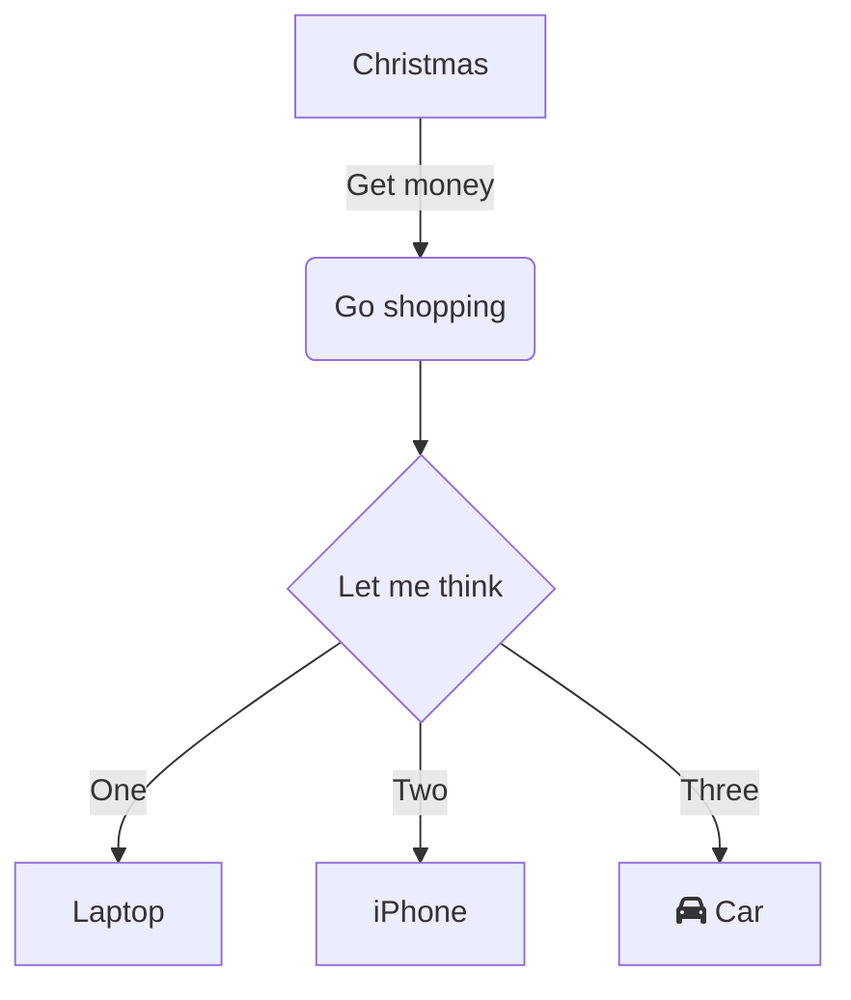

# 這是 `Markdown x Pandoc` 範例

這是一個可以使用 Pandoc 轉換成 PDF的 Markdown 檔案的範例。

## Headers

```markdown
# This is an <h1> tag

## This is an <h2> tag

### This is an <h3> tag

#### This is an <h4> tag

##### This is an <h5> tag

###### This is an <h6> tag

```

## Emphasis

```markdown
*This text will be italic*
_This will also be italic_

**This text will be bold**
__This will also be bold__

_You **can** combine them_

~~This text will be strikethrough~~
```

## Lists

### Unordered

```markdown
- Item 1
- Item 2
  - Item 2a
  - Item 2b
```

### Ordered

```markdown
1. Item 1
2. Item 2
3. Item 3
   1. Item 3a
   2. Item 3b
```

## Images

```markdown


Format:


```

## Links

```markdown
http://github.com - automatic!
[GitHub](http://github.com)
```

## Blockquotes

```markdown
As Kanye West said:

> We're living the future so
> the present is our past.
```

## Horizontal Rule

```markdown
Three or more...

---

Hyphens

---

Asterisks

---

Underscores
```

## Inline code

```markdown
I think you should use an
`<addr>` element here instead.
```

## Code Blocks

```markdown
```javascript
function fancyAlert(arg) {
  if(arg) {
    $.facebox({div:'#foo'})
  }
}
```

```

## Task lists

```markdown
- [x] @mentions, #refs, [links](), **formatting**, and <del>tags</del> supported
- [x] list syntax required (any unordered or ordered list supported)
- [x] this is a complete item
- [ ] this is an incomplete item
```

## Tables

```markdown
| Fruit   | Price | Advantages         |
| ------- | ----- | ------------------ |
| Bananas | $1.34 | - built-in wrapper |
|         |       | - bright color     |
| Oranges | $2.10 | - cures scurvy     |
|         |       | - tasty            |
```

\pagebreak

+---------+-------+--------------------+
|  Fruit  | Price |     Advantages     |
+=========+=======+====================+
| Bananas | $1.34 | - built-in wrapper |
|         |       | - bright color     |
+---------+-------+--------------------+
| Oranges | $2.10 | - cures scurvy     |
|         |       | - tasty            |
+---------+-------+--------------------+

\pagebreak



## 參考連結

- https://shd101wyy.github.io/markdown-preview-enhanced/#/
